# Design Document: Kiro Starter Kit

## Overview

The Kiro Starter Kit is a template Git repository providing a fully configured Kiro workspace out of the box. It contains no application code — only Kiro configuration artifacts: steering files, hooks, powers, sub-agents, MCP configs, skills, and documentation. Users clone or fork the repo and immediately have a best-practice Kiro environment they can customize.

The design prioritizes discoverability, self-documentation (every file has inline comments), and modularity (each file is independent and can be added/removed without affecting others).

## Architecture

The Starter Kit is a static file repository with no runtime components, build steps, or dependencies. The architecture is a well-organized directory tree.

```mermaid
graph TD
    A[Repository Root] --> B[README.md]
    A --> C[LICENSE]
    A --> D[.gitignore]
    A --> E[.kiro/]
    E --> F[steering/]
    E --> G[hooks/]
    E --> H[powers/]
    E --> I[agents/]
    E --> J[mcp.json]
    E --> K[skills/]

    F --> F1[coding-standards.md]
    F --> F2[testing-standards.md]
    F --> F3[aws-best-practices.md]
    F --> F4[security-standards.md]
    F --> F5[code-review-standards.md]
    F --> F6[documentation-standards.md]

    G --> G1[auto-test-generation.md]
    G --> G2[pre-commit-review.md]
    G --> G3[doc-generation.md]
    G --> G4[dependency-security-check.md]
    G --> G5[iac-validation.md]
    G --> G6[commit-message-generator.md]

    H --> H1[on-save-lint.md]
    H --> H2[scheduled-dependency-audit.md]
    H --> H3[context-aware-suggestions.md]
    H --> H4[multi-step-deploy-check.md]

    I --> I1[code-reviewer.md]
    I --> I2[test-generator.md]
    I --> I3[doc-writer.md]
    I --> I4[security-auditor.md]
    I --> I5[refactoring-assistant.md]
    I --> I6[debugger.md]
    I --> I7[architecture-reviewer.md]
    I --> I8[performance-optimizer.md]

    K --> K1[scaffold-microservice.md]
    K --> K2[generate-crud-api.md]
    K --> K3[setup-cicd.md]
    K --> K4[generate-db-migration.md]
    K --> K5[create-frontend-component.md]
    K --> K6[write-test-suite.md]
    K --> K7[generate-api-client.md]
    K --> K8[security-audit.md]
    K --> K9[setup-monitoring.md]
    K --> K10[generate-iac.md]
```



There are no inter-component dependencies. Each file is self-contained and can be added, removed, or modified independently.

## Components and Interfaces

### 1. Steering Files (`.kiro/steering/`)

Each steering file is a standalone Markdown document containing rules that Kiro applies globally during code generation and review. All steering files follow a consistent internal structure:

```markdown
# [Category] Standards

<!-- Scope: Global -->
<!-- Description: Brief one-liner -->

## Overview

[Brief introduction explaining the purpose of these standards]

## Rules

### [Rule Category]

- **Rule Name**: [Description of the rule and what Kiro should enforce]
- **Rule Name**: [Description]

### [Another Rule Category]

- **Rule Name**: [Description]
```

**Files (6 total):**

| File | Purpose | Requirements |
|---|---|---|
| `coding-standards.md` | Naming, formatting, documentation, error handling | Req 2 |
| `testing-standards.md` | Test organization, naming, structure, mocking, PBT | Req 3 |
| `aws-best-practices.md` | IAM, tagging, encryption, logging, IaC | Req 4 |
| `security-standards.md` | Input validation, secrets, dependencies, auth, encoding | Req 5 |
| `code-review-standards.md` | Review scope, feedback tone, checklists, approval criteria | Req 6 |
| `documentation-standards.md` | README structure, API docs, inline comments, changelogs | Req 7 |

All steering files are language-agnostic and written in imperative rule form.

### 2. Agent Hooks (`.kiro/hooks/`)

Hooks are event-driven automations that trigger Kiro actions in response to development events. Each hook file defines a trigger event, optional conditions, and the action Kiro performs.

```markdown
# Hook: [Hook Name]

<!-- Trigger: [event type, e.g., on-save, pre-commit, on-demand] -->
<!-- Description: Brief one-liner -->

## Description

[What this hook does and when it activates]

## Trigger

- **Event**: [The event that activates this hook, e.g., "file saved", "pre-commit"]
- **Conditions**: [Optional filters, e.g., "only .ts files", "only in src/ directory"]

## Action

[Detailed description of what Kiro does when the hook fires]

## Configuration

<!-- Inline comments explaining any configurable parameters -->
```

**Files (6 total):**

| File | Purpose | Trigger | Requirements |
|---|---|---|---|
| `auto-test-generation.md` | Generate/update unit tests when source files change | on-save | Req 8.1 |
| `pre-commit-review.md` | Run code review on staged changes before commit | pre-commit | Req 8.2 |
| `doc-generation.md` | Update docs when public APIs are modified | on-save | Req 8.3 |
| `dependency-security-check.md` | Check for vulnerabilities in new dependencies | on-save (package files) | Req 8.4 |
| `iac-validation.md` | Validate IaC templates on save | on-save (IaC files) | Req 8.5 |
| `commit-message-generator.md` | Generate commit message from staged changes | pre-commit / on-demand | Req 8.6 |

### 3. Power Configurations (`.kiro/powers/`)

Powers are higher-level automations that demonstrate different automation patterns. Each power file defines a pattern type, trigger, and action sequence.

```markdown
# Power: [Power Name]

<!-- Pattern: [event-driven | scheduled | context-aware | multi-step] -->
<!-- Description: Brief one-liner -->

## Description

[What this power does and the automation pattern it demonstrates]

## Trigger

[Event, schedule, or context condition that activates this power]

## Action

[Step-by-step description of what happens when triggered]

## Notes

<!-- Inline comments explaining customization options -->
```

**Files (4 total):**

| File | Pattern | Purpose | Requirements |
|---|---|---|---|
| `on-save-lint.md` | Event-driven | Lint and auto-fix on file save | Req 9.1 |
| `scheduled-dependency-audit.md` | Scheduled | Periodic dependency vulnerability scan | Req 9.2 |
| `context-aware-suggestions.md` | Context-aware | Adapt suggestions based on project type | Req 9.3 |
| `multi-step-deploy-check.md` | Multi-step | Chain lint → test → build → deploy readiness check | Req 9.4 |

### 4. Sub-Agent Configurations (`.kiro/agents/`)

Sub-agents are specialized AI personas with scoped tool access and focused system prompts. Each agent file defines the agent's identity, capabilities, and permissions.

```markdown
# Agent: [Agent Name]

<!-- Specialization: [area of expertise] -->
<!-- Description: Brief one-liner -->

## Description

[What this agent specializes in and when to use it]

## System Prompt

[Detailed instructions that shape the agent's behavior, tone, and focus areas]

## Tools

<!-- List of permitted tools this agent can use -->
- [tool_name]: [why this agent needs it]
- [tool_name]: [why this agent needs it]

## Usage Examples

[Example prompts a user might give this agent]
```

**Files (8 total):**

| File | Specialization | Requirements |
|---|---|---|
| `code-reviewer.md` | Code quality, correctness, style feedback | Req 10.1 |
| `test-generator.md` | Unit tests, property-based tests | Req 10.2 |
| `doc-writer.md` | README, API docs, inline comments | Req 10.3 |
| `security-auditor.md` | Vulnerability identification, remediation | Req 10.4 |
| `refactoring-assistant.md` | Code improvements preserving behavior | Req 10.5 |
| `debugger.md` | Error analysis, root cause identification | Req 10.6 |
| `architecture-reviewer.md` | System design evaluation | Req 10.7 |
| `performance-optimizer.md` | Bottleneck identification, optimization | Req 10.8 |

### 5. MCP Server Configuration (`.kiro/mcp.json`)

A single JSON file that registers external MCP tool servers. The Starter Kit includes 3-4 example entries with placeholder values and an accompanying comment block in the README explaining each entry.

```json
{
  "mcpServers": {
    "server-name": {
      "command": "npx",
      "args": ["-y", "@scope/mcp-server-package"],
      "env": {
        "API_KEY": "${ENV_VAR_NAME}"
      }
    }
  }
}
```

**Entries (3-4 total):**

| Server Name | Purpose | Requirements |
|---|---|---|
| `filesystem` | File system operations and context gathering | Req 11.1 |
| `postgres` | Database querying and schema inspection | Req 11.2 |
| `brave-search` | Web search and knowledge retrieval | Req 11.3 |
| `github` | GitHub API integration (issues, PRs, repos) | Req 11.6 (bonus) |

All sensitive values use `${VAR_NAME}` placeholder syntax. The README documents each required environment variable.

### 6. Skill Definitions (`.kiro/skills/`)

Skills are repeatable workflow templates that users invoke on demand. Each skill defines inputs, a sequence of steps, and expected outputs.

```markdown
# Skill: [Skill Name]

<!-- Category: [scaffolding | generation | setup | audit] -->
<!-- Description: Brief one-liner -->

## Description

[What this skill does and when to use it]

## Inputs

<!-- Parameters the user provides before the skill runs -->
- **[param_name]**: [description] (required/optional)

## Steps

<!-- Ordered list of actions Kiro performs -->
1. [Step description]
2. [Step description]
3. [Step description]

## Expected Output

[What the user gets when the skill completes]

## Notes

<!-- Customization tips and caveats -->
```

**Files (10 total):**

| File | Purpose | Category | Requirements |
|---|---|---|---|
| `scaffold-microservice.md` | Create new microservice with standard structure | scaffolding | Req 12.1 |
| `generate-crud-api.md` | Generate CRUD endpoints with validation | generation | Req 12.2 |
| `setup-cicd.md` | Set up CI/CD pipeline config | setup | Req 12.3 |
| `generate-db-migration.md` | Generate DB migration from schema description | generation | Req 12.4 |
| `create-frontend-component.md` | Create React/frontend component with tests | scaffolding | Req 12.5 |
| `write-test-suite.md` | Generate comprehensive test suite for a module | generation | Req 12.6 |
| `generate-api-client.md` | Generate API client from OpenAPI spec | generation | Req 12.7 |
| `security-audit.md` | Audit codebase for vulnerabilities | audit | Req 12.8 |
| `setup-monitoring.md` | Set up monitoring and alerting | setup | Req 12.9 |
| `generate-iac.md` | Generate IaC templates from architecture description | generation | Req 12.10 |

### 7. Documentation (`README.md`)

The README is the primary onboarding document. Structure:

```markdown
# Kiro Starter Kit

## Table of Contents
[Auto-generated links to all sections]

## Quick Start
1. Clone the repository
2. Open in your IDE with Kiro
3. Verify the setup
4. Start customizing

## What's Included

### Steering Files
[Description + link to .kiro/steering/]

### Hooks
[Description + link to .kiro/hooks/]

### Powers
[Description + link to .kiro/powers/]

### Sub-Agents
[Description + link to .kiro/agents/]

### MCP Servers
[Description + link to .kiro/mcp.json]

### Skills
[Description + link to .kiro/skills/]

## Customization Guide
[How to add, modify, remove configs]

## Contributing
[Community contribution guidelines]

## License
[License reference]
```

### 8. Supporting Files

- **`LICENSE`**: MIT license for maximum community adoption.
- **`.gitignore`**: Ignores OS files, editor configs, and any local environment files. Keeps the repo clean.

## Data Models

This project has no runtime data models. All artifacts are static files. The only structured data file is `mcp.json`:

```typescript
interface McpConfig {
  mcpServers: Record<string, McpServerEntry>;
}

interface McpServerEntry {
  command: string;
  args: string[];
  env?: Record<string, string>;
}
```

## Correctness Properties

*A property is a characteristic or behavior that should hold true across all valid executions of a system — essentially, a formal statement about what the system should do. Properties serve as the bridge between human-readable specifications and machine-verifiable correctness guarantees.*

### Analysis

The Kiro Starter Kit is a static file repository with no runtime logic, no parsers, no serializers, and no data transformations. Every acceptance criterion is a structural or content-presence check on a specific, known file. There are no functions that accept a range of inputs, no round-trip operations, and no invariants to maintain across transformations.

All validation maps to example-based tests:
- File existence checks (does `coding-standards.md` exist?)
- File count checks (are there at least 6 steering files?)
- Content section checks (does the file contain a "Naming Conventions" section?)
- JSON structure checks (does `mcp.json` parse and contain required fields?)

### Properties

No testable properties. All acceptance criteria map to example-based structural validation tests.

## Error Handling

Since the Starter Kit is a static file repository with no runtime components, traditional error handling does not apply. The relevant concerns are:

1. **Invalid JSON in `mcp.json`**: The file must be valid JSON. A validation test parses it to catch syntax errors. If a user introduces a syntax error while customizing, their editor or Kiro will flag it.

2. **Missing required sections in Markdown files**: If a user removes a required section from a steering file, the file still functions — Kiro simply has fewer rules to apply. The README notes which sections are recommended.

3. **Environment variable placeholders in `mcp.json`**: The `${VAR_NAME}` placeholders will fail at runtime if the variables are not set. The README quick-start section instructs users to configure these variables before using MCP servers.

4. **Broken relative links in README**: If files are renamed or moved, README links may break. The customization guide advises users to update links when reorganizing.

## Testing Strategy

### Approach

Since the Starter Kit has no runtime code, testing focuses on structural validation — ensuring the repository ships with all required files and that each file contains the expected content sections. A shell script (`validate.sh`) at the repository root performs all checks, keeping the kit dependency-free.

### Test Type: Repository Structure Validation (Example-Based)

A single validation script checks the entire repository. Test groups:

1. **Directory structure tests** — Verify all required directories exist and contain the expected number of files.
   - _Validates: Requirements 1.1–1.9_

2. **Steering file content tests** — For each of the six steering files, verify the file contains required section headings or keywords matching each acceptance criterion.
   - _Validates: Requirements 2.1–2.5, 3.1–3.5, 4.1–4.5, 5.1–5.5, 6.1–6.4, 7.1–7.4_

3. **Hook configuration tests** — Verify each of the six hook files exists and contains trigger, action, and inline comment sections.
   - _Validates: Requirements 8.1–8.8_

4. **Power configuration tests** — Verify each of the four power files exists and contains the expected pattern type, trigger, and action sections.
   - _Validates: Requirements 9.1–9.6_

5. **Sub-agent configuration tests** — Verify each of the eight agent files exists and contains name, system prompt, tools, and inline comments.
   - _Validates: Requirements 10.1–10.10_

6. **MCP configuration tests** — Parse `mcp.json`, verify it contains 3-4 server entries each with command, args, and env fields using `${VAR_NAME}` placeholders.
   - _Validates: Requirements 11.1–11.6_

7. **Skill definition tests** — Verify each of the ten skill files exists and contains name, inputs, steps, and inline comments.
   - _Validates: Requirements 12.1–12.12_

8. **README content tests** — Verify the README contains table of contents, quick-start, sections for each config type, customization guide, and contributing section.
   - _Validates: Requirements 13.1–13.5_

### Property-Based Testing

Not applicable for this project. The Starter Kit contains no runtime logic, parsers, serializers, or data transformations that would benefit from property-based testing. All validation is example-based.

### Test Tooling

A shell script (`validate.sh`) at the repository root performs all structural checks using basic file existence tests and `grep` for content verification. This keeps the Starter Kit dependency-free. Optionally, a GitHub Actions workflow can run `validate.sh` on every PR.
